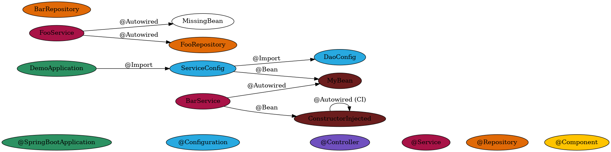

# Spring Visualizer

Spring visualizer produces a graph of the application context based on your Java code.

## Features

1. Configuration classes with
   - edges to their imports and
   - bean definitions.
2. Component scanning overview including
   - which packages and
   - which component are scanned,
   - with warnings when components are not scanned. (TODO)
3. Overview of
   - autowired dependencies of components, and
   - warnings when they are not component-scanned components or defined as beans. (TODO)
4. Configuration of what to include in the final graph with clap.

## Installation

You'll likely want `dot` from graphviz too to produce an image from the graph output.
Install it with `brew install graphviz`, `sudo apt install graphviz`, or any other package manager.

To install `spring-visualizer` itself, just use cargo.

```sh
cargo install --git https://github.com/rudsvar/spring-visualizer
```

Then run this to see what it can do.

```sh
spring-visualizer -h
```

## Example

If you run the command below

```sh
spring-visualizer com/example/demo > demo/example.dot && dot -Tpng demo/example.dot -o demo/example.png
```

then you will get the following output:



## Logging

You can enable logging by setting the `RUST_LOG` environment variable.
Try prepending `RUST_LOG=info` or `RUST_LOG=spring-visualizer=debug` to the example command.
